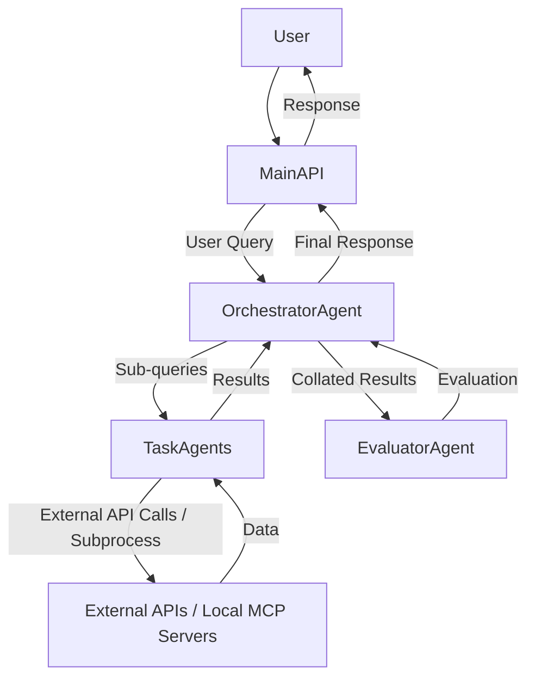

# Deltaverse Multi-Agent Financial Insights

This project implements an AI-powered multi-agent system designed to provide personalized financial insights. It leverages a modular architecture where different agents specialize in specific tasks, orchestrated to process natural language queries and deliver comprehensive responses.

## Table of Contents

1.  [Project Overview](#project-overview)
2.  [Architecture](#architecture)
    *   [Main API (FastAPI)](#main-api-fastapi)
    *   [Orchestrator Agent](#orchestrator-agent)
    *   [Evaluator Agent](#evaluator-agent)
    *   [Task Agents](#task-agents)
    *   [MCP Servers (Microservice Communication Protocol)](#mcp-servers-microservice-communication-protocol)
3.  [Functionality](#functionality)
    *   [Query Processing Flow](#query-processing-flow)
    *   [Authentication](#authentication)
    *   [Feature Flags](#feature-flags)
    *   [Mock Data Integration](#mock-data-integration)
4.  [Setup and Running Locally](#setup-and-running-locally)
    *   [Prerequisites](#prerequisites)
    *   [Installation](#installation)
    *   [Environment Variables](#environment-variables)
    *   [Running the Application](#running-the-application)
    *   [Testing with Postman/cURL](#testing-with-postmancurl)
5.  [Agent-Specific Details & Configuration](#agent-specific-details--configuration)
    *   [FI MCP Agent](#fi-mcp-agent)
    *   [Yahoo MCP Agent](#yahoo-mcp-agent)
    *   [MoSPI API Agent](#mospi-api-agent)
    *   [Mint MCP Agent (Conceptual)](#mint-mcp-agent-conceptual)
    *   [YNAB MCP Agent](#ynab-mcp-agent)
    *   [Zerodha Coin MCP Agent](#zerodha-coin-mcp-agent)
    *   [ElevenLabs API Agent](#elevenlabs-api-agent)

---

## 1. Project Overview

The Deltaverse Multi-Agent Financial Insights system is designed to understand and respond to user queries related to personal finance. It acts as a central hub that dispatches sub-queries to specialized "Task Agents," aggregates their responses, and provides a coherent, evaluated final answer. The system is built with modularity and extensibility in mind, allowing easy integration of new data sources and functionalities.

## 2. Architecture

The project follows a multi-agent architecture, where different components are responsible for distinct parts of the query processing pipeline.



### Main API (FastAPI)

*   **Location:** `src/main.py`
*   **Role:** The entry point for user interactions. It exposes a RESTful API endpoint (`/query`) where users submit their natural language financial questions. It orchestrates the high-level flow by interacting with the `OrchestratorAgent` and `EvaluatorAgent`.

### Orchestrator Agent

*   **Location:** `src/agents/orchestrator/orchestrator_agent.py`
*   **Role:** The brain of the system. It receives user queries from the Main API, breaks them down into smaller, manageable sub-queries (potentially using an LLM), and dispatches these sub-queries to the appropriate `TaskAgents`. It then collects and collates the results from these `TaskAgents` and passes them to the `EvaluatorAgent`. Finally, it aggregates the evaluated results into a comprehensive final response for the user.
*   **Communication:** Directly invokes methods on `TaskAgent` instances.

### Evaluator Agent

*   **Location:** `src/agents/evaluator/evaluator_agent.py`
*   **Role:** Responsible for assessing the quality and completeness of the collated results from the `TaskAgents` in response to the original user query. It determines if the query has been sufficiently answered or if further processing (e.g., re-orchestration) is required.

### Task Agents

*   **Location:** `src/agents/task_agents/` (e.g., `fi_mcp_agent.py`, `yahoo_mcp_agent.py`, etc.)
*   **Role:** Specialized agents designed to interact with specific external financial data sources or services. Each `TaskAgent` encapsulates the logic for connecting to its respective "MCP Server" (which can be a direct API, a local subprocess, or a conceptual integration). They receive sub-queries from the `OrchestratorAgent`, fetch relevant data, and return it.
*   **Communication:** Use `requests` for HTTP APIs or `subprocess` for local stdio-based servers.

### MCP Servers (Microservice Communication Protocol)

*   **Location:** `src/mcp_servers/`
*   **Role:** These are external services or local processes that the `TaskAgents` interact with to retrieve data. They can be:
    *   **Direct External APIs:** (e.g., YNAB, ElevenLabs)
    *   **Local Mock Servers:** (e.g., `fi-mcp-dev-master`, `yfinance_mcp_server.py`)
    *   **Conceptual Integrations:** (e.g., Mint, due to lack of official API)
*   **Note:** For local mock servers, each typically runs on a dedicated port or communicates via stdio.

## 3. Functionality

### Query Processing Flow

1.  A user sends a natural language financial query to the `/query` endpoint of the Main API.
2.  The Main API passes the query to the `OrchestratorAgent`.
3.  The `OrchestratorAgent` (conceptually using an LLM) breaks down the query into sub-queries and identifies the relevant `TaskAgents`.
4.  The `OrchestratorAgent` directly calls the `process_query` method on the identified `TaskAgents`.
5.  Each `TaskAgent` executes its specialized task (e.g., fetching stock prices, listing budgets) by interacting with its respective external service or local MCP server.
6.  `TaskAgents` return their results to the `OrchestratorAgent`.
7.  The `OrchestratorAgent` collates these results and passes them to the `EvaluatorAgent`.
8.  The `EvaluatorAgent` assesses the collated results.
9.  Based on the evaluation, the `OrchestratorAgent` either aggregates a final response or determines if further steps are needed.
10. The final response is sent back through the Main API to the user.

### Authentication

*   **Google Cloud Service Account:** The project supports service account-based authentication for Google Cloud services (e.g., Secret Manager, Pub/Sub if re-enabled). The service account key JSON can be provided via the `GCP_SERVICE_ACCOUNT_KEY_JSON` environment variable, which is then written to a temporary file and set as `GOOGLE_APPLICATION_CREDENTIALS`.
*   **External API Keys:** Each `TaskAgent` is configured to retrieve its necessary API keys or tokens from environment variables (e.g., `YNAB_ACCESS_TOKEN`, `ELEVENLABS_API_KEY`).

### Feature Flags

Individual feature flags are implemented for each `TaskAgent` to enable or disable its connection to external MCP servers. This is useful for development, testing, or running the application with only a subset of functionalities.

*   **Environment Variables:**
    *   `ENABLE_FI_MCP` (defaults to `true`)
    *   `ENABLE_YAHOO_MCP` (defaults to `true`)
    *   `ENABLE_MOSPI_API` (defaults to `true`)
    *   `ENABLE_MINT_MCP` (defaults to `true`)
    *   `ENABLE_YNAB_MCP` (defaults to `true`)
    *   `ENABLE_ZERODHA_COIN_MCP` (defaults to `true`)
    *   `ENABLE_ELEVENLABS_API` (defaults to `true`)
*   Setting any of these to `false` (e.g., `ENABLE_YAHOO_MCP=false`) will cause the corresponding agent to return mock data instead of attempting an external connection.

### Mock Data Integration

When a `TaskAgent`'s feature flag is set to `false`, it will return predefined mock data from `src/common/mock_agent_data.py`. This allows for isolated testing and development of the agent orchestration without requiring live external API access or running all local MCP servers.

## 4. Setup and Running Locally

### Prerequisites

*   Python 3.9+
*   Go 1.23+ (only if running `fi-mcp-dev-master` locally)
*   `pip` (Python package installer)

### Installation

1.  **Clone the repository:**
    ```bash
    git clone https://github.com/your-repo/deltaverse-multiagent.git
    cd deltaverse-multiagent
    ```
2.  **Create and activate a virtual environment:**
    ```bash
    python3 -m venv .venv
    source .venv/bin/activate
    ```
3.  **Install Python dependencies:**
    ```bash
    pip install -r requirements.txt
    ```
4.  **Install Go dependencies for `fi-mcp-dev-master` (if you plan to run it):**
    ```bash
    cd fi-mcp-dev-master
    go mod tidy
    cd ..
    ```

### Environment Variables

Create a `.env` file in the root directory of your project and populate it with the necessary environment variables.

```dotenv
# GCP Configuration (for service account authentication)
# GCP_SERVICE_ACCOUNT_KEY_JSON='{"type": "service_account", ...}' # Paste your service account key JSON here (single line)
GCP_PROJECT_ID="your-gcp-project-id"
PUBSUB_TOPIC_PREFIX="deltaverse-financial-insights" # Used by Orchestrator/Evaluator if Pub/Sub is re-enabled

# MCP Server URLs (for local development, each agent connects to its specific port)
FI_MCP_SERVER_URL="http://localhost:8001"
YAHOO_MCP_SERVER_URL="http://localhost:8002"
MOSPI_API_SERVER_URL="http://localhost:8003"
MINT_MCP_SERVER_URL="http://localhost:8004"
YNAB_MCP_SERVER_URL="http://localhost:8005"
ZERODHA_COIN_MCP_SERVER_URL="http://localhost:8006"
ELEVENLABS_API_SERVER_URL="http://localhost:8007"

# Feature Flags (set to 'false' to enable mock data for a specific agent)
ENABLE_FI_MCP=true
ENABLE_YAHOO_MCP=true
ENABLE_MOSPI_API=true
ENABLE_MINT_MCP=true
ENABLE_YNAB_MCP=true
ENABLE_ZERODHA_COIN_MCP=true
ENABLE_ELEVENLABS_API=true

# API Keys/Tokens for External Services (replace with your actual credentials)
# MOSPI_API_KEY="your_mospi_api_key" # Hypothetical
# YNAB_ACCESS_TOKEN="your_ynab_personal_access_token"
# KITE_API_KEY="your_zerodha_kite_api_key"
# KITE_API_SECRET="your_zerodha_kite_api_secret"
# KITE_REQUEST_TOKEN="your_zerodha_kite_request_token_from_oauth_callback" # Obtained after web login
# ELEVENLABS_API_KEY="your_elevenlabs_api_key"
```

### Running the Application

To run the full system, you'll typically need multiple terminal windows:

1.  **Start `fi-mcp-dev-master` (if `ENABLE_FI_MCP=true`):**
    ```bash
    cd fi-mcp-dev-master
    FI_MCP_PORT=8001 go run .
    ```
2.  **Start `yfinance_mcp_server.py` (if `ENABLE_YAHOO_MCP=true`):**
    ```bash
    python src/mcp_servers/yfinance_mcp_server.py
    ```
3.  **Start the Main FastAPI Application:**
    ```bash
    uvicorn src.main:app --host 0.0.0.0 --port 8000
    ```

### Testing with Postman/cURL

Once the applications are running, you can send requests to the main API.

**Endpoint:** `POST http://localhost:8000/query`

**Request Body (JSON):**

```json
{
  "user_id": "unique_user_identifier",
  "query": "How much money will I have at 40?"
}
```

**Example Queries for Specific Agents (when enabled):**

*   **FI MCP Agent:** "What are my bank transactions?" (This will trigger the `fetch_bank_transactions` method in the mock server.)
*   **Yahoo MCP Agent:** "What is the stock price of AAPL?"
*   **MoSPI API Agent:** "GDP growth for 2023"
*   **Mint MCP Agent:** "What are my account balances?" (Always returns mock data)
*   **YNAB MCP Agent:** "list budgets" or "transactions for budget <your_budget_id>"
*   **Zerodha Coin MCP Agent:** "get zerodha profile"
*   **ElevenLabs API Agent:** "Convert this text to speech: Hello, how are you?"

## 5. Agent-Specific Details & Configuration

### FI MCP Agent

*   **File:** `src/agents/task_agents/fi_mcp_agent.py`
*   **Integration:** Connects to the `fi-mcp-dev-master` Go server.
*   **Endpoint:** `http://localhost:8001/mcp/stream`
*   **Authentication:** Requires manual web-based login for the `fi-mcp-dev-master` server. If `login_required` is returned, open the `login_url` in a browser, use a dummy phone number (from `fi-mcp-dev-master/README.md`), and then re-send the query.
*   **Mock Data:** Returns `MOCK_FI_MCP_RESPONSE` if `ENABLE_FI_MCP=false`.

### Yahoo MCP Agent

*   **File:** `src/agents/task_agents/yahoo_mcp_agent.py`
*   **Integration:** Communicates with a local Python `yfinance_mcp_server.py` via standard input/output (`subprocess`).
*   **Server Location:** `src/mcp_servers/yfinance_mcp_server.py`
*   **Action:** You must run `python src/mcp_servers/yfinance_mcp_server.py` in a separate terminal.
*   **Mock Data:** Returns `MOCK_YAHOO_MCP_RESPONSE` if `ENABLE_YAHOO_MCP=false`.

### MoSPI API Agent

*   **File:** `src/agents/task_agents/mospi_api_agent.py`
*   **Integration:** Direct HTTP calls to a hypothetical `https://api.mospi.gov.in/v1/data` endpoint.
*   **Authentication:** Requires `MOSPI_API_KEY` environment variable. (Note: This is a hypothetical API key for demonstration; there is no official public MoSPI API with such a key.)
*   **Mock Data:** Returns `MOCK_MOSPI_API_RESPONSE` if `ENABLE_MOSPI_API=false`.

### Mint MCP Agent (Conceptual)

*   **File:** `src/agents/task_agents/mint_mcp_agent.py`
*   **Integration:** Conceptual only. Due to the lack of an official API and security risks, this agent does not make real external calls.
*   **Mock Data:** Always returns `MOCK_MINT_MCP_RESPONSE`.

### YNAB MCP Agent

*   **File:** `src/agents/task_agents/ynab_mcp_agent.py`
*   **Integration:** Direct HTTP calls to the YNAB API (`https://api.ynab.com/v1`).
*   **Authentication:** Requires `YNAB_ACCESS_TOKEN` (Personal Access Token) from your YNAB Developer Settings.
*   **Mock Data:** Returns `MOCK_YNAB_LIST_BUDGETS_RESPONSE` or `MOCK_YNAB_TRANSACTIONS_RESPONSE` based on query if `ENABLE_YNAB_MCP=false`.

### Zerodha Coin MCP Agent

*   **File:** `src/agents/task_agents/zerodha_coin_mcp_agent.py`
*   **Integration:** Uses the official `kiteconnect` Python SDK.
*   **Authentication:** Requires `KITE_API_KEY`, `KITE_API_SECRET`, and `KITE_REQUEST_TOKEN` environment variables. The `KITE_REQUEST_TOKEN` is obtained via a manual OAuth web login flow. The agent will print the `login_url`.
*   **Mock Data:** Returns `MOCK_ZERODHA_PROFILE_RESPONSE` if `ENABLE_ZERODHA_COIN_MCP=false`.

### ElevenLabs API Agent

*   **File:** `src/agents/task_agents/elevenlabs_api_agent.py`
*   **Integration:** Direct HTTP calls to the ElevenLabs API (`https://api.elevenlabs.io/v1`).
*   **Authentication:** Requires `ELEVENLABS_API_KEY` environment variable.
*   **Mock Data:** Returns `MOCK_ELEVENLABS_AUDIO_RESPONSE` if `ENABLE_ELEVENLABS_API=false`.
