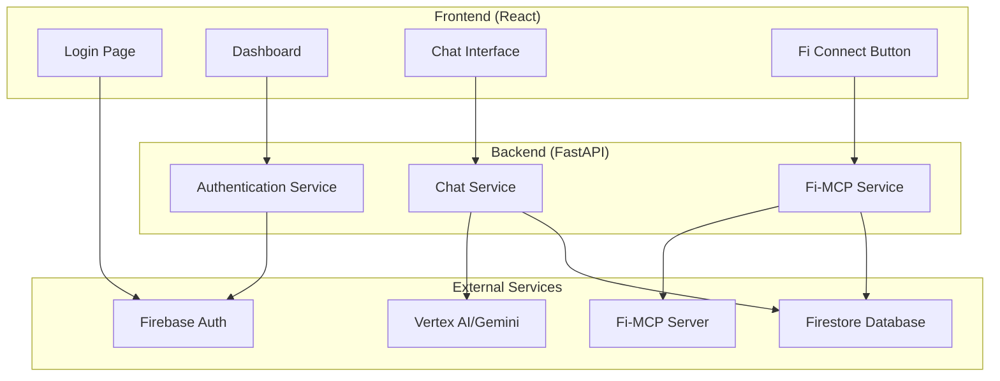
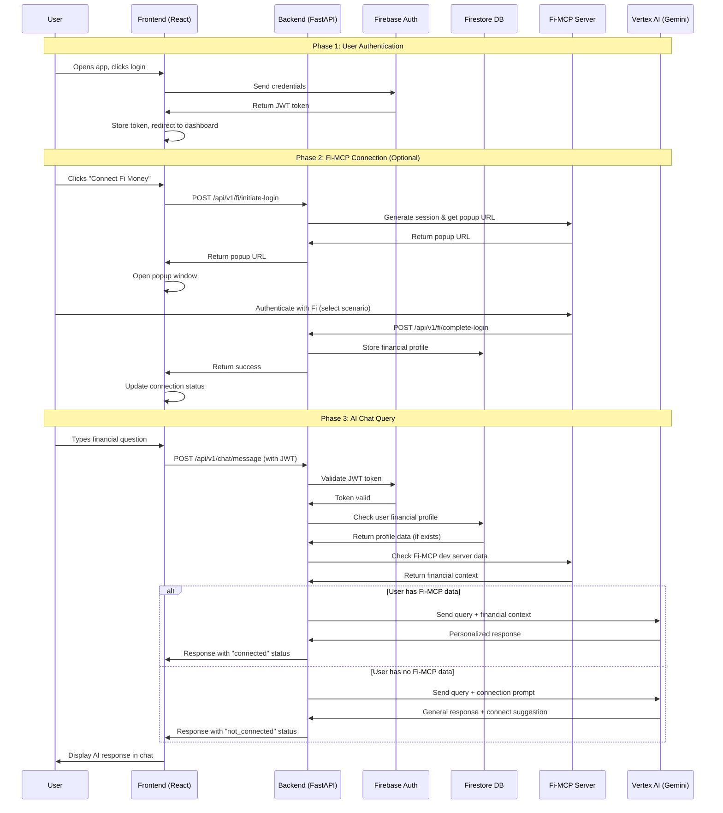
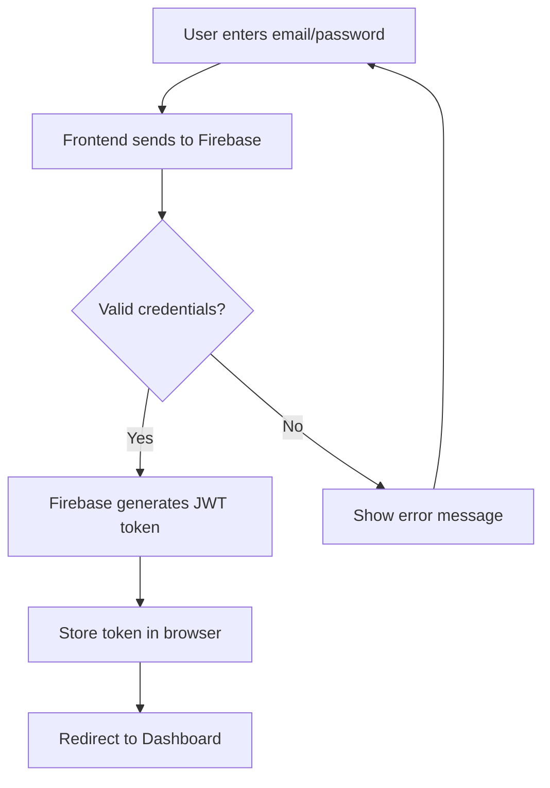
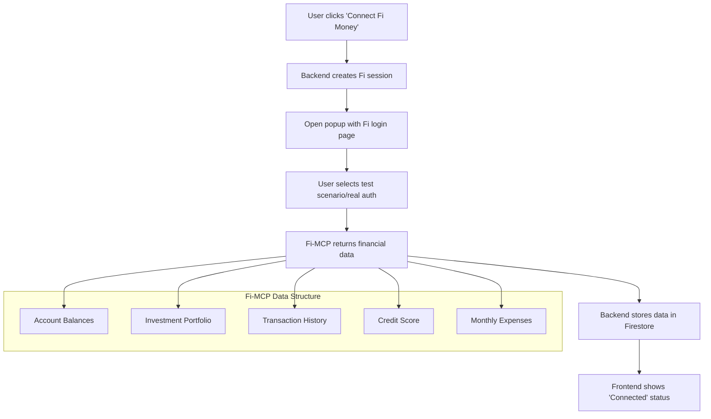
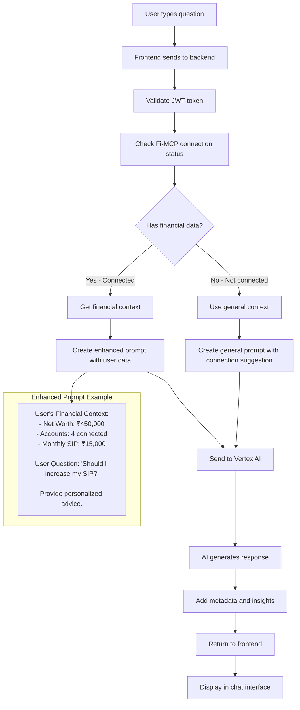

# 🚀 DeltaVerse Complete User Flow Guide

> **For Freshers**: This guide explains the complete journey from user login to AI-powered financial advice

## 📋 Table of Contents
1. [Overview](#overview)
2. [System Architecture](#system-architecture)
3. [Complete Flow Diagram](#complete-flow-diagram)
4. [Phase-by-Phase Breakdown](#phase-by-phase-breakdown)
5. [Code Examples](#code-examples)
6. [Troubleshooting](#troubleshooting)

---

## 🎯 Overview

DeltaVerse is a financial advisory platform that combines:
- **Firebase Authentication** for secure user login
- **Fi-MCP Integration** for real financial data access
- **AI-Powered Advice** using Google's Vertex AI (Gemini)

**Simple Explanation**: Think of it like a smart financial advisor that knows your real bank account details and gives personalized advice!

---

## 🏗️ System Architecture



---

## 🔄 Complete Flow Diagram



---

## 📚 Phase-by-Phase Breakdown

### 🔐 Phase 1: Firebase Authentication

**What happens**: User logs into the app securely



**Key Files**:
- `deltaverse-ui/src/pages/Login/Login.jsx` - Login form
- `deltaverse-ui/src/hooks/useAuth.js` - Authentication logic
- `deltaverse-ui/src/services/firebase/config.js` - Firebase setup

**What JWT Token Contains**:
```json
{
  "user_id": "firebase_user_123",
  "email": "user@example.com",
  "exp": 1640995200,
  "iat": 1640908800
}
```

---

### 💰 Phase 2: Fi-MCP Connection

**What happens**: User connects their financial accounts for personalized advice



**Development vs Production**:

| Environment | Data Source | Authentication |
|-------------|-------------|----------------|
| **Development** | Fi-MCP dev server | Test scenarios (phone numbers) |
| **Production** | Real Fi Money API | Actual bank login |

**Test Scenarios Available** (Development):
- `2222222222` - All Assets Connected (₹4.5L net worth)
- `7777777777` - Debt-Heavy User (₹2.1L debt)
- `8888888888` - SIP Investor (₹15K monthly SIP)

---

### 🤖 Phase 3: AI Query Processing

**What happens**: User asks a financial question and gets AI-powered advice



**Query Types**:

1. **Personal Financial Query** (requires Fi-MCP):
   - "What's my portfolio performance?"
   - "Should I increase my SIP?"
   - "How much should I save this month?"

2. **General Financial Query** (no Fi-MCP needed):
   - "What are mutual funds?"
   - "How does compound interest work?"
   - "What is a credit score?"

---

## 💻 Code Examples

### 🔐 Authentication Flow

```javascript
// Frontend: Login component
const handleLogin = async (email, password) => {
  try {
    const userCredential = await signInWithEmailAndPassword(auth, email, password);
    const token = await userCredential.user.getIdToken();
    
    // Store token for API calls
    localStorage.setItem('authToken', token);
    
    // Redirect to dashboard
    navigate('/dashboard');
  } catch (error) {
    setError(error.message);
  }
};
```

```python
# Backend: JWT validation
async def auth_dependency(authorization: str = Header(None)):
    if not authorization or not authorization.startswith('Bearer '):
        raise HTTPException(status_code=401, detail="Missing or invalid token")
    
    token = authorization.split(' ')[1]
    try:
        decoded_token = auth.verify_id_token(token)
        return decoded_token['uid']  # Firebase user ID
    except Exception as e:
        raise HTTPException(status_code=401, detail="Invalid token")
```

### 💰 Fi-MCP Connection

```javascript
// Frontend: Connect Fi Money
const connectFiMoney = async () => {
  try {
    const response = await fetch('/api/v1/fi/initiate-login', {
      method: 'POST',
      headers: {
        'Authorization': `Bearer ${authToken}`,
        'Content-Type': 'application/json'
      }
    });
    
    const { popup_url, session_id } = await response.json();
    
    // Open popup window
    const popup = window.open(popup_url, 'fi-login', 'width=500,height=600');
    
    // Listen for completion
    const checkClosed = setInterval(() => {
      if (popup.closed) {
        clearInterval(checkClosed);
        checkConnectionStatus();
      }
    }, 1000);
  } catch (error) {
    console.error('Fi connection failed:', error);
  }
};
```

```python
# Backend: Fi-MCP integration
@app.post("/api/v1/fi/initiate-login")
async def initiate_fi_login(firebase_user_id: str = Depends(auth_dependency)):
    try:
        # Generate unique session
        session_id = f"fi-session-{uuid.uuid4()}"
        
        # Create Fi-MCP popup URL
        popup_url = f"{FI_MCP_SERVER_URL}/mockWebPage?sessionId={session_id}"
        
        return {
            "popup_url": popup_url,
            "session_id": session_id,
            "status": "initiated"
        }
    except Exception as e:
        raise HTTPException(status_code=500, detail=str(e))
```

### 🤖 AI Chat Processing

```python
# Backend: Chat message processing
@app.post("/api/v1/chat/message")
async def chat_message(
    chat_message: ChatMessage,
    firebase_user_id: str = Depends(auth_dependency)
):
    # Check if user has Fi-MCP data
    has_fi_data = await check_fi_mcp_status(firebase_user_id)
    
    if has_fi_data and is_personal_query(chat_message.message):
        # Get financial context
        financial_data = await get_financial_context(firebase_user_id)
        
        # Create enhanced prompt
        enhanced_prompt = f"""
        User's Financial Context:
        - Net Worth: ₹{financial_data['net_worth']:,}
        - Connected Accounts: {financial_data['account_count']}
        - Monthly SIP: ₹{financial_data['sip_amount']:,}
        
        User Question: "{chat_message.message}"
        
        Provide personalized financial advice based on their actual data.
        """
        
        # Send to Vertex AI
        ai_response = await vertex_ai.generate_content(enhanced_prompt)
        
        return {
            "message": ai_response,
            "mcp_integration": {"status": "connected"},
            "insights": [
                "Based on your actual financial data",
                f"Your Fi account is connected ({financial_data['account_count']} accounts)"
            ]
        }
    else:
        # General response with connection prompt
        general_prompt = f"""
        User asked: "{chat_message.message}"
        
        Provide helpful general advice and suggest connecting Fi Money account 
        for personalized insights.
        """
        
        ai_response = await vertex_ai.generate_content(general_prompt)
        
        return {
            "message": ai_response,
            "mcp_integration": {"status": "not_connected"},
            "requires_fi_auth": True,
            "insights": [
                "Connect your Fi Money account for personalized recommendations"
            ]
        }
```

---

## 🔍 Data Flow Examples

### 📊 Financial Data Structure

```json
{
  "user_id": "firebase_user_123",
  "sync_status": "success",
  "last_updated": "2025-07-24T14:05:25Z",
  "portfolio": {
    "total_value": 450000,
    "sip_amount": 15000,
    "accounts": [
      {
        "bank": "HDFC Bank",
        "type": "Savings",
        "balance": 125000
      },
      {
        "bank": "ICICI Bank", 
        "type": "Investment",
        "balance": 325000
      }
    ]
  },
  "net_worth": {
    "total_assets": 450000,
    "total_liabilities": 50000,
    "net_worth": 400000
  },
  "expenses": {
    "monthly_total": 35000,
    "categories": {
      "food": 12000,
      "transport": 8000,
      "utilities": 5000,
      "entertainment": 10000
    }
  }
}
```

### 🤖 AI Response Structure

```json
{
  "message": "Based on your portfolio of ₹4.5L and monthly SIP of ₹15K, I recommend...",
  "requires_fi_auth": false,
  "conversation_id": "conv_123",
  "insights": [
    "This is AI-generated financial guidance",
    "Your Fi account is connected (4 accounts)",
    "Based on your actual transaction data"
  ],
  "timestamp": "2025-07-24T14:05:25.511322",
  "model_info": {
    "model_name": "Gemini-2.0-Flash-Exp",
    "version": "1.0.0",
    "ai_powered": true
  },
  "mcp_integration": {
    "status": "connected",
    "data_source": "fi_mcp_dev",
    "has_financial_data": true,
    "financial_context": {
      "has_data": true,
      "account_count": 4,
      "net_worth": 400000
    }
  }
}
```

---

## 🛠️ Development Setup

### 🚀 Quick Start

1. **Start Fi-MCP Server**:
   ```bash
   cd fi-mcp-dev-master
   FI_MCP_PORT=8080 go run .
   ```

2. **Start Backend**:
   ```bash
   cd deltaverse-api
   uvicorn app.main:app --reload --port 8002
   ```

3. **Start Frontend**:
   ```bash
   cd deltaverse-ui
   npm start
   ```

### 🧪 Testing Flow

1. **Login**: Use test credentials
2. **Connect Fi**: Click "Connect Fi Money" → Select test scenario
3. **Ask AI**: Type "What's my portfolio performance?"
4. **Verify**: Check response has `"status": "connected"`

---

## 🐛 Troubleshooting

### Common Issues

| Issue | Cause | Solution |
|-------|-------|----------|
| `mcp_integration.status: "not_connected"` | Fi-MCP server not running | Start Fi-MCP server on port 8080 |
| `401 Unauthorized` | Invalid JWT token | Re-login to get fresh token |
| `Fi connection failed` | Popup blocked | Allow popups for localhost |
| `AI response generic` | Fi-MCP data not detected | Check Firestore and Fi-MCP server |

### 🔍 Debug Commands

```bash
# Check Fi-MCP server status
curl http://localhost:8080/health

# Test chat endpoint
curl -X POST http://localhost:8002/api/v1/chat/message \
  -H "Authorization: Bearer YOUR_JWT_TOKEN" \
  -H "Content-Type: application/json" \
  -d '{"message": "What is my net worth?", "user_id": "test_user"}'

# Check Firestore data
# Go to Firebase Console → Firestore → financial_profiles collection
```

---

## 🎯 Key Takeaways for Freshers

1. **Authentication First**: Every API call needs a valid JWT token
2. **Fi-MCP is Optional**: App works without it, but gives generic advice
3. **AI Context Matters**: More user data = better AI responses
4. **Error Handling**: Always have fallbacks for external services
5. **Development vs Production**: Different data sources, same flow

---

## 📚 Further Reading

- [Firebase Authentication Docs](https://firebase.google.com/docs/auth)
- [Vertex AI Documentation](https://cloud.google.com/vertex-ai/docs)
- [FastAPI Documentation](https://fastapi.tiangolo.com/)
- [React Hooks Guide](https://reactjs.org/docs/hooks-intro.html)

---

**🎉 Congratulations!** You now understand the complete DeltaVerse user flow from login to AI-powered financial advice!
