# 🎨 DeltaVerse Visual Flow Diagram

## 🔄 Complete User Journey

```mermaid
graph TD
    subgraph "🔐 Phase 1: Authentication"
        A[👤 User Opens App] --> B[📝 Login Page]
        B --> C[🔑 Firebase Auth]
        C --> D[✅ JWT Token Generated]
        D --> E[🏠 Dashboard]
    end
    
    subgraph "💰 Phase 2: Fi-MCP Connection (Optional)"
        E --> F{💭 Want Personalized Advice?}
        F -->|Yes| G[🔗 Click 'Connect Fi Money']
        F -->|No| M[💬 Ask General Questions]
        G --> H[🪟 Popup Opens]
        H --> I[📱 Fi Authentication]
        I --> J[💾 Store Financial Data]
        J --> K[✅ Connection Success]
    end
    
    subgraph "🤖 Phase 3: AI Chat"
        K --> L[💬 Ask Personal Questions]
        M --> N[🧠 AI Processing]
        L --> O[🧠 AI + Financial Context]
        
        O --> P[🎯 Personalized Response]
        N --> Q[📚 General Response]
        
        P --> R[💬 Display in Chat]
        Q --> R
    end
    
    style A fill:#e1f5fe
    style E fill:#f3e5f5
    style K fill:#e8f5e8
    style P fill:#fff3e0
    style Q fill:#fce4ec
```

## 🔍 Detailed Sequence Flow

## 🎯 Decision Tree: AI Response Logic

```mermaid
flowchart TD
    A[👤 User asks question] --> B{🔍 Is it personal financial query?}
    
    B -->|Yes| C{💰 Has Fi-MCP data?}
    B -->|No| D[📚 General financial education]
    
    C -->|Yes| E[🎯 Personalized advice with real data]
    C -->|No| F[💡 General advice + connection prompt]
    
    D --> G[🤖 AI: Educational response]
    E --> H[🤖 AI: Personal response with context]
    F --> I[🤖 AI: General + 'Connect Fi for more']
    
    G --> J[📱 Display response]
    H --> J
    I --> J
    
    style E fill:#c8e6c9
    style F fill:#ffecb3
    style D fill:#e1f5fe
```

## 📊 Data Flow Architecture

```mermaid
graph LR
    subgraph "📱 Frontend (React)"
        A[Login Page]
        B[Dashboard]
        C[Chat Interface]
        D[Fi Connect Button]
    end
    
    subgraph "⚡ Backend (FastAPI)"
        E[Auth Service]
        F[Chat Service]
        G[Fi-MCP Service]
    end
    
    subgraph "☁️ External Services"
        H[🔥 Firebase Auth]
        I[💰 Fi-MCP Server]
        J[🤖 Vertex AI]
        K[📊 Firestore DB]
    end
    
    A -.->|JWT Token| H
    B -->|Protected Routes| E
    C -->|Chat Messages| F
    D -->|Connect Request| G
    
    E -->|Validate Token| H
    F -->|AI Queries| J
    F -->|User Data| K
    G -->|Financial Data| I
    G -->|Store Profile| K
    
    style A fill:#e3f2fd
    style E fill:#f3e5f5
    style H fill:#fff3e0
```

## 🔄 State Management Flow

## 🎨 UI Component Hierarchy

```mermaid
graph TD
    A[🏠 App.js] --> B[🔐 AuthProvider]
    B --> C[📱 Dashboard]
    B --> D[💬 Chat Page]
    
    C --> E[👤 User Profile]
    C --> F[💰 Fi Connect Button]
    C --> G[📊 Health Score Button]
    
    D --> H[💬 Chat Interface]
    D --> I[📝 Message Input]
    D --> J[🤖 AI Response]
    
    F --> K[🪟 Fi Login Popup]
    J --> L[💡 Insights Panel]
    J --> M[🔗 Connection Prompt]
    
    style A fill:#e8f5e8
    style C fill:#e3f2fd
    style D fill:#fff3e0
    style F fill:#ffecb3
```

## 🚀 Quick Reference: API Endpoints

```mermaid
graph LR
    subgraph "🔐 Authentication"
        A[POST /login] --> B[JWT Token]
    end
    
    subgraph "💰 Fi-MCP Integration"
        C[POST /api/v1/fi/initiate-login] --> D[Popup URL]
        E[POST /api/v1/fi/complete-login] --> F[Success Status]
    end
    
    subgraph "🤖 AI Chat"
        G[POST /api/v1/chat/message] --> H[AI Response]
        I[GET /api/v1/chat/insights] --> J[Financial Insights]
    end
    
    subgraph "📊 Data"
        K[GET /api/v1/mcp/summary] --> L[Financial Summary]
    end
    
    style A fill:#ffcdd2
    style C fill:#c8e6c9
    style G fill:#dcedc8
    style K fill:#e1f5fe
```

---

## 🎯 For Freshers: Key Concepts

### 🔑 Authentication
- **JWT Token**: Like a digital ID card that proves you're logged in
- **Firebase**: Google's service that handles user login/logout
- **Protected Routes**: Pages that require login to access

### 💰 Fi-MCP Integration
- **MCP**: Model Context Protocol - a way to connect AI with external data
- **Fi Money**: Indian fintech app that provides banking data
- **Session**: Temporary connection between our app and Fi Money

### 🤖 AI Processing
- **Vertex AI**: Google's AI service (like ChatGPT but from Google)
- **Context**: Additional information given to AI for better responses
- **Prompt**: The instruction we send to AI along with user's question

### 📊 Data Flow
- **Frontend**: What user sees (React app)
- **Backend**: Server that processes requests (FastAPI)
- **Database**: Where we store user information (Firestore)

---

**💡 Pro Tip**: Start by understanding one phase at a time. Master authentication first, then Fi-MCP, then AI integration!
