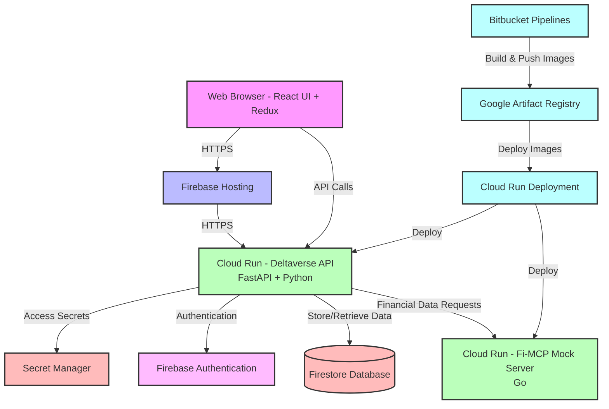

# Deltaverse Architecture Diagram

## System Architecture

## Architecture Components

### Frontend
- **Technology**: React + Redux
- **Hosting**: Firebase Hosting

### Backend API
- **Technology**: FastAPI + Python (UV package manager)
- **Deployment**: Google Cloud Run

### Fi-MCP Mock Server
- **Technology**: Go
- **Deployment**: Google Cloud Run

### Data Storage
- **Primary Database**: Firestore

### Authentication
- **System**: Firebase Authentication

### CI/CD Pipeline
- **Platform**: Bitbucket Pipelines
